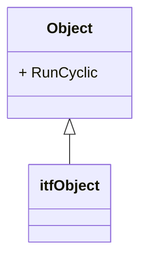
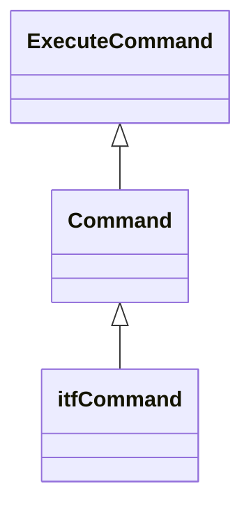

# @simatic-ax.commands

## Description

This library provides abstract base classes for PLC Open handling.

## Install this package

Enter:

```cli
apax add @simatic-ax/commands
```

## Namespace

```iec-st
Simatic.Ax.Commands;
```

## Object

Base Objects for cyclic calls and initialize method.



## Command Interface/Classes

Classes for PlcOpen support



### itfCommand

```iec-st
NAMESPACE Simatic.Ax.Commands

    INTERFACE itfCommand
        METHOD Busy : BOOL
        END_METHOD
        METHOD Done : BOOL
        END_METHOD
        METHOD CommandAborted : BOOL
        END_METHOD
        METHOD Error : BOOL
        END_METHOD
        METHOD ErrorID : WORD
        END_METHOD
    END_INTERFACE

END_NAMESPACE
```


### Command IMPLEMENTS itfCommand

Simple PlcOpen Command for enabling commands


### ExecuteCommand EXTENDS Command

Simple PlcOpenCOmmand for


## Contribution

Thanks for your interest in contributing. Anybody is free to report bugs, unclear documentation, and other problems regarding this repository in the Issues section or, even better, is free to propose any changes to this repository using Merge Requests.

### Markdownlint-cli

This workspace will be checked by the [markdownlint-cli](https://github.com/igorshubovych/markdownlint-cli) (there is also documented ho to install the tool) tool in the CI workflow automatically.  
To avoid, that the CI workflow fails because of the markdown linter, you can check all markdown files locally by running the markdownlint with:

```sh
markdownlint **/*.md --fix
```

## License and Legal information

Please read the [Legal information](LICENSE.md)
